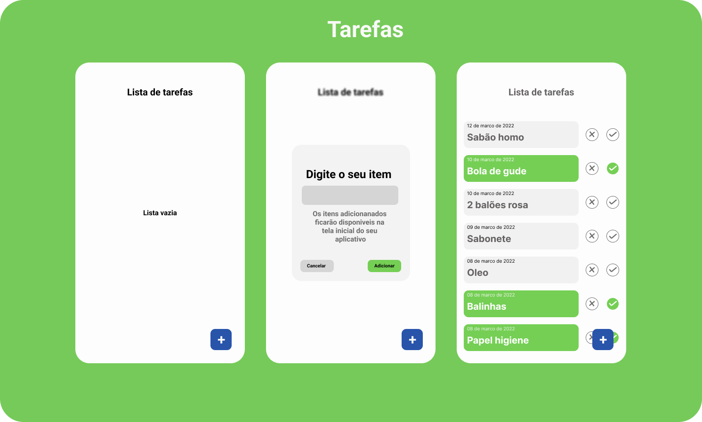

# **Aplicativo de tarefas**

Aplicativo Desenvolvido em flutter.

## Terefas

É um simples aplicativo que ajuda seus usuário a não esquecer de realizar suas tarefas diarias.

Tem opção de **adicionar** suas ***tarefas*** incluindo **data e hora do SO**. Depois da tarefa ser adicionada, o mesmo **pode excluir** e **marcar como concluida**. Após marcar como concluida, as tarefas **em estado concluida**, _irão formar uma lista organizada por odem de conclusão, data e hora._

> #### bibliotecas utitizadas 

- _path_ [link](https://pub.dev/packages/path)
- _sqflite_ [link](https://pub.dev/packages/sqflite)
- _intl_ [link](https://pub.dev/packages/intl)
- _material design 3_

> #### Layout do app

> **Tela APP**
